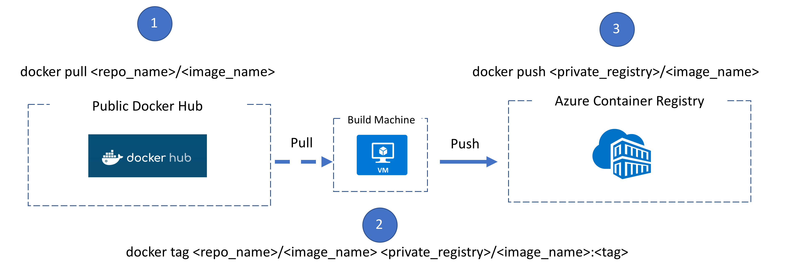

# Working with Web App for Containers

In this lab you will be working with Web App for Containers which is one of the easiest ways to get started with building Web or REST-based APIs with Containers.

## Deployment Methods:

### 1. Deploy Container via Portal
This method allows you to visually configure your Azure App Service to pull in ```kevingbb/bobble``` from Docker Hub (public image)
- In the Azure Portal, navigate to your Web App you can configure/link/point to ``kevingbb/bobble`` from Docker Hub (public image)

### 2. Deploy Container via CLI
This method allows you to script and configure your Web App to pull in ``kevingbb/bobble`` from Docker Hub (public image)
- Using Azure-CLI, create a new app service plan ```az appservice plan``` ... **Note:** Don't forget ```--is-linux``` flag
- Now create the app ```az webapp create``` ***Note:*** Don't forget to specify a container image source ```-i``` flag

### 3. Directly with Git
This method is ___not___ a contianer exercise.  Rather this is a different deployment method.  This will not build/deploy an updated container, but rather will directly connect your Github repo to Azure App Services.  This is done through a webhook to Azure App Services, which will trigger Azure App Services to ```pull``` in the new code and reload your web app everytime you ```push``` new code to your repository, on a specified repo ```branch``` (usually ```master``` branch).

- Create new Web App using same App Service Plan
- Create new local web application using dotnet Core or Node or Python
- Create initialize a new Git Repo in command line
```:bash
    git init
    git add .
    git commit -m "Initial commit."
```
- Push local Git Repo to Web App service
```:bash
    git remote add ...
    git push ...
```

### 4. Private Registry (Azure Container Registry - ACR)
- Create an Azure Container Registry (ACR)
- Pull in a public image from docker hub
- Re-tag the public image and namespace it to your private registry (hint: ```<registry_name>.azurecr.io```)
- Link your new ACR to your Web App for Containers Service (WACS)
    - You can do this in the portal or CLI
    - You can also enable Continuous Deployment when the ACR image is updated (pushed to ACR)



#### Notes:
1. By default the ```docker``` command knows to ```pull``` from docker hub registry
2. In order to ```push``` to your registry you must be logged in by running ```docker login <your-private-repo-url>```
    - ```docker login``` by itself will log you in to docker hub
        - you must include a URL to authenticate against a privately hosted registry (like Azure Container Registry)
    - after logging into your registry, credentials are cached for future use
        - for Azure Container Registry your username is the same as ```<registry_name>```.azurecr.io
        - the password can be found in your Azure Container Registry Dashboard in the Azure Portal
3. You can check your cached credentials in your ```.docker/config.json``` in your home folder
    - you will see the registries your're logged into and can ```push``` to
4. By tagging images with ```<registry_name>/<image_name>``` docker will resolve this name to the proper ```<registry_name>``` to push/pull to
    - simple names like ```kevingbb/<image_name>``` are likely docker hub registries
    - complex names like ```<registry_name>.azurecr.io/<image_name>``` are privately hosted registries (not docker hub)
    


## Troubleshooting

Trouble shooting into the container is done through Kudu and the console Kudu provides.  This allows you to SSH into the container from Kudu web interface.  The container is otherwise inaccessible directly via SSH.

## Advanced:

1. Deploy Custom Container from Private Registry
2. Add SSH access to custom Container via Kudu
    **Hint:** Need to install SSH via Dockerfile and setup with a specific user
3. Implement Continuous Integration
    **Hint:** Leverage Blade in Portal
