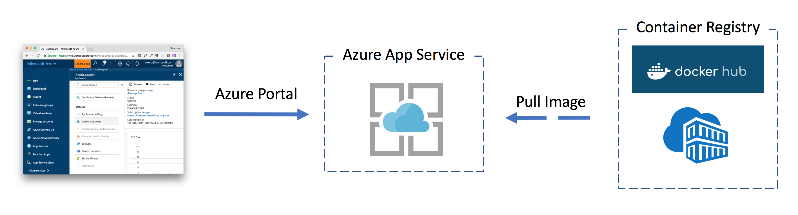
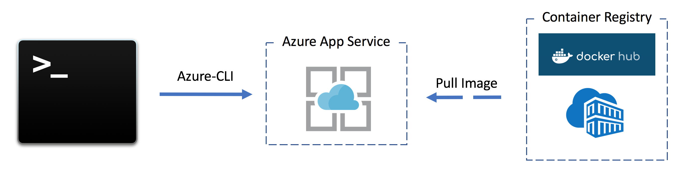
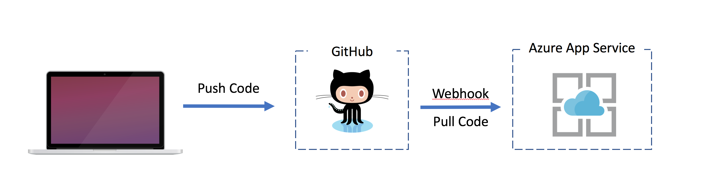

# Working with Web App for Containers

In this lab you will be working with Web App for Containers which is one of the easiest ways to get started with building Web or REST-based APIs with Containers.

## Deployment Methods:

### 1. Deploy a Container via the Azure Portal

The purpose of this section is to help you understand how easy it is to get started with **Web App for Containers** using the Azure Portal.



This method allows you to visually configure your Azure App Service to pull in ```kevingbb/bobble``` from Docker Hub (public image)
- In the Azure Portal, create a **Web App for Containers** app and configure ``kevingbb/bobble`` as the image to pull from Docker Hub (public image)
- This method is good for running a single container.

### 2. Deploy a Container via the Azure CLI and scripting

The purpose of this section is to help you understand how you can script the createion of **Web for Containers** for DevOps purposes or if you are the type of person that does not like to use GUI Tool.



This method allows you to script and configure your Web App to pull in ``kevingbb/bobble`` from Docker Hub (public image)
- Using Azure-CLI, create a new app service plan ```az appservice plan``` ... **Note:** Don't forget ```--is-linux``` flag
- Now create the app ```az webapp create``` ***Note:*** Don't forget to specify a container image source ```-i``` flag
- This method is best for an automated scripted process

If you are stuck, check out the [command_examples.sh](command_examples.sh) file in this folder.

### 3. Deploy an App with GitHub

**This method is ___not___ a container exercise.**
The purpose of this section is to help you understand that there is more than one type of deployment option when it comes to App Service and Linux.



**This will not build/deploy a container**, but rather will directly connect your Github repo to Azure App Service on Linux.  This is done through a webhook to Azure App Services, which will trigger Azure App Services to ```pull``` in the new code and reload your web app everytime you ```push``` new code to your repository, on a specified repo ```branch``` (usually ```master``` branch).

- Create new Web App using Linux as the OS and leveraging the same App Service Plan as the previous exercise
- Create new local (meaning running on local machine) web application using dotnet Core or Node or Python (this part of the excercise is left up to the user as there are lots of articles out there on how to do this)
- Once you have your application up and running on your local machine, initialize a new Git Repo via the ```git``` command line
```:bash
    git init
    git add .
    git commit -m "Initial commit."
```
- Push local Git Repo to Web App service:
```:bash
    git remote add ...
    git push ...
```
- This will cause App Service on Linux to pull in the new code (via a webhook) and mount it into a Run Time Environment (Pre-baked Container for your programming language)
- This method is good for deploying application **code** directly to the App Service.

**Hint:** Click [here](https://docs.microsoft.com/en-us/azure/app-service/app-service-deploy-local-git) if you are having difficulties.

## Troubleshooting

Trouble shooting into the container is done through Kudu and the console Kudu provides.  This allows you to SSH into the container from Kudu web interface.  The container is otherwise inaccessible directly via SSH. See the **Making a client connection** section of the following article, click [here](https://docs.microsoft.com/en-us/azure/app-service/containers/app-service-linux-ssh-support).

## Advanced:

1. Add SSH access to custom Container via Kudu
    - **Hint:** Need to install SSH via Dockerfile and setup with a specific user, click [here](https://docs.microsoft.com/en-us/azure/app-service/containers/app-service-linux-ssh-support) for details.
2. Implement Continuous Integration & Continuous Deployment (CI/CD)
    - **Hint #1:** Enable Continuous Deployment feature and leverage ``webhook``, click [here](https://docs.microsoft.com/en-us/azure/app-service/containers/app-service-linux-ci-cd) for details.
    - **Hint #2:** Enabled CI/CD with VSTS, click [here](https://docs.microsoft.com/en-us/vsts/build-release/apps/cd/deploy-docker-webapp)
