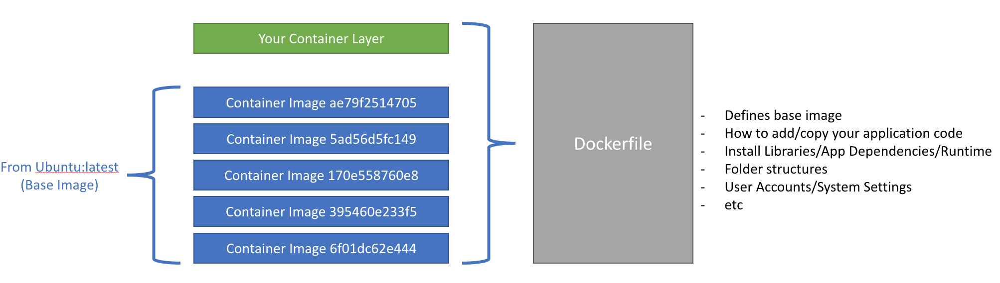
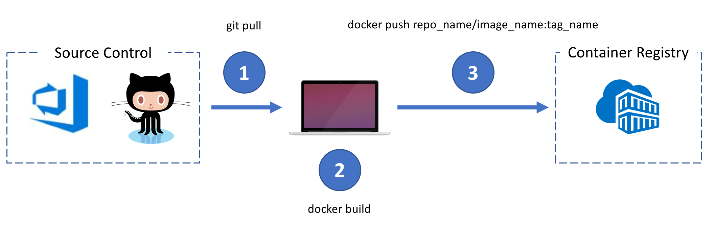

# Building containers with Docker tools

This lab provides an introduction to Docker command line tools and the workflow for using existing (public) Docker images, creating new Docker images, adding new images to a private registry and then deploying the image for use in a standalone environment.


## 1. Introduction to Docker

In this section we will leverage https://KataCoda.com and use their interactive exercises.

- Click [here](https://katacoda.com/courses/docker) and do the following exercises:
    - ``Deploying Your First Docker Container``
    - ``Building Container Images``

## 2. Deploy a container via a Private Container Registry (Azure Container Registry - ACR)

The purpose of this section is to help you understand how to clone/copy images via the PULL (from public image repositories), TAG (update versioning and/or destination registry) and PUSH (to registry) flow with the docker command line tool (aka docker client).

- Create an Azure Container Registry (ACR)
- Pull in a public image from docker hub (e.g. ```kevingbb/bobble```)
- Re-tag the public image and namespace it to your private registry (hint: ```<registry_name>.azurecr.io/<image_name>```)


### Notes:

- By default the ```docker``` command knows to ```pull``` from docker hub registry
- In order to ```push``` to your registry you must be logged in by running ```docker login <your-private-repo-url>```
    - ```docker login``` by itself will log you in to docker hub
        - you must include a URL to authenticate against a privately hosted registry (like Azure Container Registry)
    - after logging into your registry, credentials are cached for future use
        - for Azure Container Registry your username is the same as ```<registry_name>```.azurecr.io
        - the password can be found in your Azure Container Registry Dashboard in the Azure Portal
- You can check your cached credentials in your ```.docker/config.json``` in your home folder
    - you will see the registries your're logged into and can ```push``` to
- By tagging images with ```<registry_name>/<image_name>``` docker will resolve this name to the proper ```<registry_name>``` to push/pull to
    - simple names like ```kevingbb/<image_name>``` are likely docker hub registries
    - complex names like ```<registry_name>.azurecr.io/<image_name>``` are privately hosted registries (not docker hub)

## 3. Build Custom Container Image

The purpose of this section is to understand how to build a Container Image from a GitHub Repository (i.e. Application Code) and script a container image build with a ```Dockerfile```. After your custom image is built you will then push it to your own Private Container Registry (i.e. Azure Container Registry - ACR).



 You will need to create a ```Dockerfile``` in your project.
 - This file is an instruction set that outlines to docker:
    - where/what/which base image you will start with
    - to which working directory you wish to start with inside your image
    - what file(s) to copy into your new container image
    - potentially which ports to map to (from your host to your running container) 
    - any potential commands to run inside your container (i.e. how to boot up your applicaion code)

- Step 1 is to build the Container Image. 
    - To make this easier, we are going to leverage the existing Tutorial in Azure Docs. Click [here](https://docs.microsoft.com/en-us/azure/aks/tutorial-kubernetes-prepare-app) to navigate to the Docs.
- Step 2 is to tag and push your Custom Container Image to ACR
    - To make this easier, we are going to leverage the existing Tutorial in Azure Docs. Click [here](https://docs.microsoft.com/en-us/azure/aks/tutorial-kubernetes-prepare-acr) to navigate to the Docs.
- Step 3 is to run the Container Application
    - To make this easier, we are going to leverage the existing Tutorial in Azure Docs. Click [here](https://docs.microsoft.com/en-us/azure/aks/tutorial-kubernetes-deploy-application) to navigate to the Docs.


